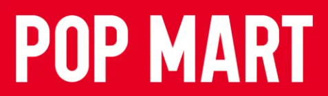

<a name="readme-top">

<br/>

[](https://wakatime.com/badge/user/f74285d8-2630-4480-a969-3a8736d4b8e2/project/4ef9f9cf-a711-45d3-a042-e3c60dd81dc7)

<br />
<div align="center">
  <a href="https://github.com/zyx-0314/">
  <!-- TODO: If you want to add logo or banner you can add it here -->
    
  </a>
<!-- TODO: Change Title to the name of the title of your Project -->
  <h3 align="center">POPMART</h3>
</div>
<!-- TODO: Make a short description -->
<div align="center">
  POP MART is a rising global force in pop culture and entertainment. Our purpose is to celebrate daily moments and inspire through designer toys and fun experiences.
</div>

<br />

<!-- TODO: Change the zyx-0314 into your github username  -->
<!-- TODO: Change the WD-Template-Project into the same name of your folder -->


---

<br />
<br />

<!-- TODO: If you want to add more layers for your readme -->
<details>
  <summary>Table of Contents</summary>
  <ol>
    <li>
      <a href="#overview">Overview</a>
      <ol>
        <li>
          <a href="#key-components">Key Components</a>
        </li>
        <li>
          <a href="#technology">Technology</a>
        </li>
      </ol>
    </li>
    <li>
      <a href="#rule,-practices-and-principles">Rules, Practices and Principles</a>
    </li>
    <li>
      <a href="#resources">Resources</a>
    </li>
  </ol>
</details>

---

## Overview

<!-- TODO: To be changed -->
<!-- The following are just sample -->
Description of the project in details.

Guiding Question:
  - What is the project?
   * The project is a website for PopMart, a toy company that wants to create a fun and interactive online space for customers. The website will have multiple pages, each dedicated to different categories of toys, information about the company, and the option to buy products directly from the site.

  - What’s the purpose?
   * The purpose of the website is to introduce PopMart's toy collection, make it easy for people to browse and shop, and create an enjoyable experience for customers. The website will also help PopMart connect with their audience and showcase the unique designs of their toys.

  - What are key components
* Website Responsiveness: Ensuring the website looks great and works well on any device.
* Multi-Page Website: Organized pages for different content sections.
* Bootstrap Embedded: Using the Bootstrap framework to streamline design and responsiveness.
  
 - What technology used and how it is used
   * HTML: This is the main building block of the website. It provides the structure and organizes the content like text, images, and links.
   * CSS: This is used along with HTML to style the website. It adds colors, fonts, and layouts, making the website look nice and easy to use.
   *Bootstrap: This tool helps make the website responsive, meaning it will look great and work well on any device, whether it's a computer, tablet, or phone.

### Key Components
<!-- TODO: List of Key Components -->
<!-- The following are just sample -->
- Website Responsiveness
- Multi-Page Website
- Bootstrap Embedded

### Technology
<!-- TODO: List of Technology Used -->


## Rules, Practices and Principles
1. Always use `WD-` in the front of the Title of the Project for the Subject followed by your custom naming.
2. Do not rename any .html files; always use `index.html` as the filename.
3. Place Files in their respective folders.
4. All file naming are in camel case.
   - Camel case is naming format where there is no white space in separation of each words, the first word is in all lower case while the succeding words first letter are in upper followed by lower cased letters.
   - ex.: buttonAnimatedStyle.css
5. Use only `External CSS`.
6. Renaming of Pages folder names are a must, and relates to what it is doing or data it holding.
7. File Structure to follow below.

```
WD-ProjectName
└─ assets
|   └─ css
|   |   └─ style.css
|   └─ img
|   |   └─ fileWith.jpeg/.jpg/.webp/.png
|   └─ js
|       └─ script.js
└─ pages
|  └─ pageName
|     └─ assets
|     |  └─ css
|     |  |  └─ style.css
|     |  └─ img
|     |  |  └─ fileWith.jpeg/.jpg/.webp/.png
|     |  └─ js
|     |     └─ script.js
|     └─ index.html
└─ index.html
└─ readme.md
```

## Resources

<!-- TODO: Add References -->
| Title | Purpose | Link |
|-|-|-|
| Sample Title | Sample purpose would be here like this and this is the example of what it is. | trykolang.com |
